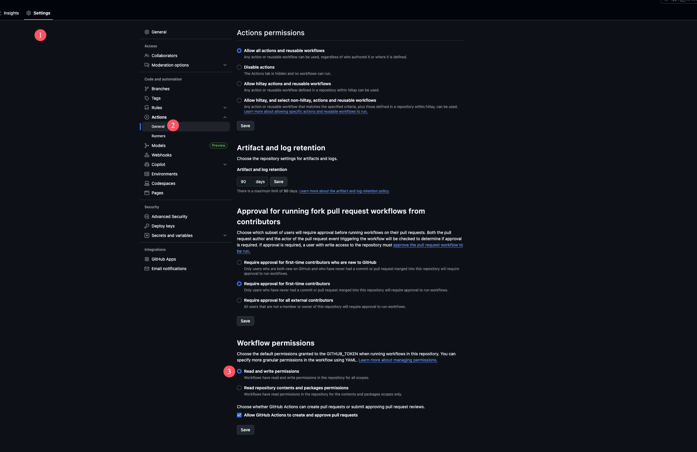
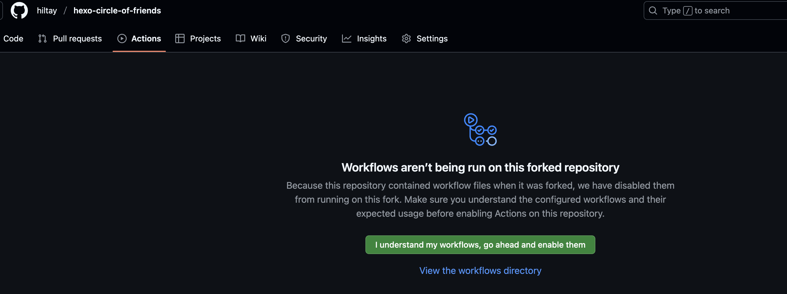

# 后端部署

<!-- > 如果您不是第一次部署而是版本更新，旧版本有些配置可能已经不兼容，请以最新版本为准！版本更新方法见[版本更新](update) -->

默认采用github action+vercel的方式实现无服务器托管，server和docker为自托管，需要自备服务器。

## github+vercel部署

部署方法：

1、fork友链朋友圈的项目仓库，地址：https://github.com/Rock-Candy-Tea/hexo-circle-of-friends 

下文称此仓库为”你的仓库“。

2、编辑项目根目录下的`fc_settings.yaml`文件，需要修改的配置如下：

```yaml
LINK:
    - {link: "https://www.yyyzyyyz.cn/link/", theme: "butterfly"}  # link改为你的友链页地址，theme选择你的博客主题
```

3、点击你的仓库`Settings-->Actions-->General`，找到`Workflow permissions`，选择`Read and write permissions`，如图：




4、点击启用你的仓库github action，点击`Actions-->I understand my workflows, go ahead and enable them`如图：



之后点击`update-friends-posts`并启用`workflow`


然后点击`Run workflow--->Run workflow`进行第一次运行


等待运行完毕后，仓库应该会上传`data.db`。

5、前往[vercel官网](https://vercel.com/)，注册并绑定github账号。

然后点击`New Project`新建项目

找到`Import Git Repository`，应该可以看见你刚刚`fork`的仓库，点击`Import`。


然后点击`Deploy`，回到首页，等待一会，应该会看到部署完成。

前往vercel，在项目中找到`DOMAINS`下面的地址，如：https://hexo-friendcircle4-api.vercel.app

在这个地址后面拼接`/all`尝试访问，出现数据就说明配置成功，这个地址就是前端所需的api地址。

注：本来只需要这个地址，但由于vercel被墙，需要绑定自定义域名后，使用自定义域名的地址


至此，后端部分搭建完成。

如果想使用其他数据库，请参考[配置项说明](settings.md)。

## 自托管部署

本项目支持用户自托管。

clone项目：

```bash
git clone https://github.com/Rock-Candy-Tea/hexo-circle-of-friends.git
```

编辑`fc_settings.yaml`文件，需要修改的配置如下：

```python
LINK:
    - {link: "https://www.yyyzyyyz.cn/link/", theme: "butterfly"}  # link改为你的友链页地址，theme选择你的博客主题
```

获取对应平台的二进制文件：https://github.com/Rock-Candy-Tea/hexo-circle-of-friends/releases  例如，对于大多数linux系统来说：

```bash
wget https://github.com/Rock-Candy-Tea/hexo-circle-of-friends/releases/download/v6.0.0/linux-x86_64-unknown-linux-musl.zip
unzip linux-x86_64-unknown-linux-musl.zip 
```

然后运行部署脚本：

```bash
chmod +x start.sh && ./start.sh
```

尝试访问API：

```bash
curl 127.0.0.1:8000/all
```

出现数据即为部署成功。可以通过配置反向代理，转发到网站的其它端口下。

接下来，开放服务器的对应端口（默认为8000），就可以通过`IP:端口`或`域名:端口`访问到API。

## 说明

### 关于存储

默认采用的存储方式为sqlite，sqlite一个无需配置的轻量级数据库，在本项目的使用场景下完全可以满足绝大部分用户的需求。如果你需要使用mysql或mongodb，请查看[配置项说明](settings.md)。

### 如何适配我的博客友链页面？

请查看[开发文档](developmentdoc.md?id=如何适配我的友链页面)