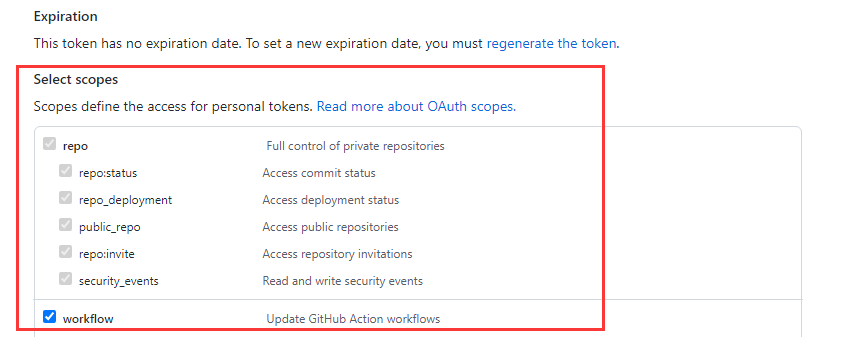
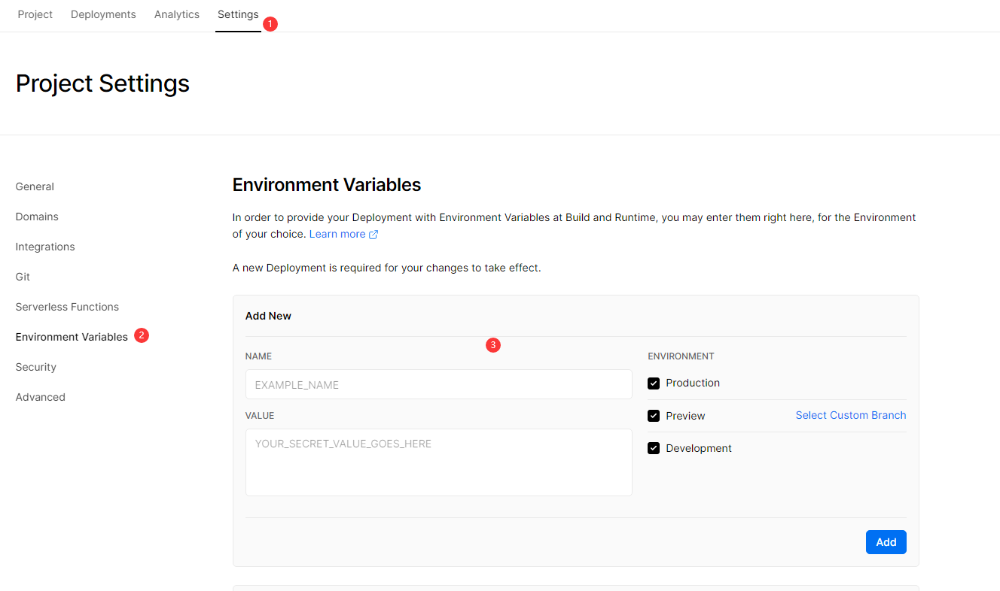
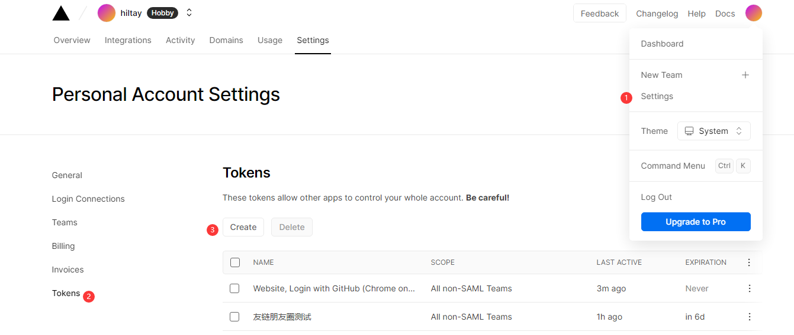
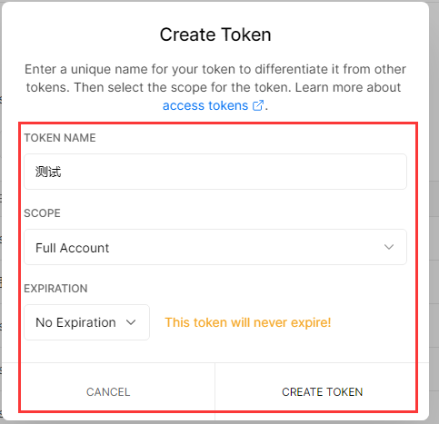
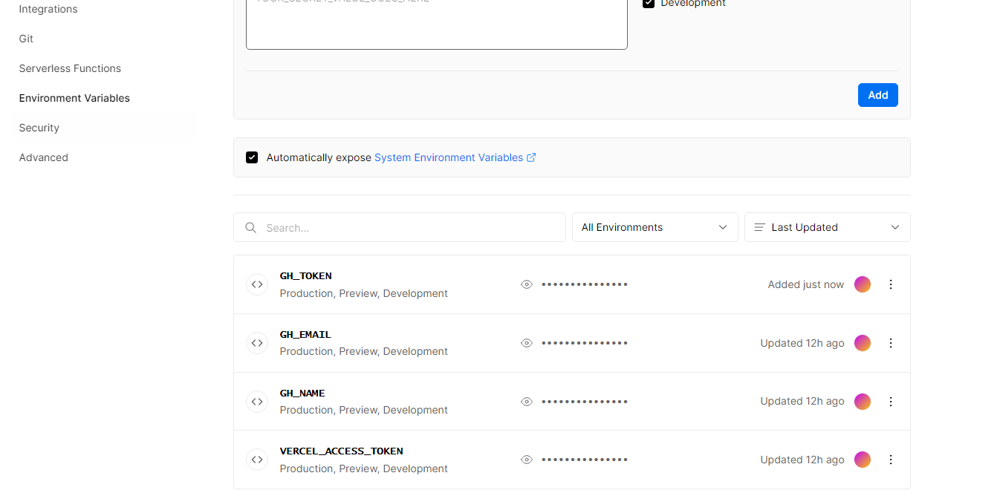
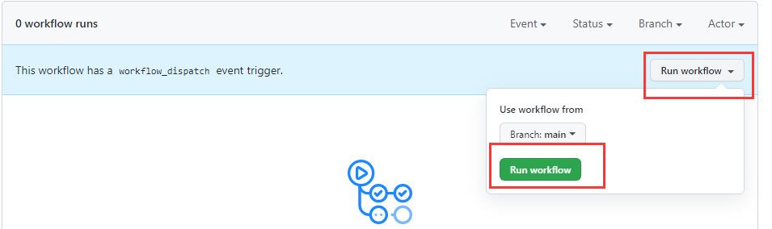
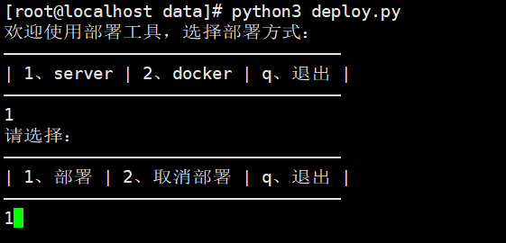
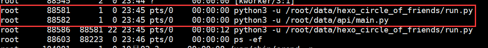

# 后端部署

> 如果您不是第一次部署而是版本更新，旧版本有些配置可能已经不兼容，请以最新版本为准！版本更新方法见[版本更新](update)

其中github为云端部署（无服务器部署），server和docker为私有部署，需要自备服务器。

## github部署

### github+sqlite部署

这是默认的部署方式，即：github+sqlite+vercel

部署方法：

fork友链朋友圈的项目仓库，地址：https://github.com/Rock-Candy-Tea/hexo-circle-of-friends

编辑`/hexo_circle_of_friends/fc_settings.yaml`文件，需要修改的配置如下：

```yaml
LINK:
    - {link: "https://www.yyyzyyyz.cn/link/", theme: "butterfly"}  # link改为你的友链页地址，theme选择你的博客主题
```

然后点击仓库的`Settings-->Secrets-->New repository secret`


添加三个环境变量secret：

- `GH_NAME`：github名称，也就是你的用户名
- `GH_EMAIL`：github邮箱，填写你注册github的邮箱
- `GH_TOKEN`：github访问token，获取方式，请参考[官方文档](https://docs.github.com/cn/authentication/keeping-your-account-and-data-secure/creating-a-personal-access-token)，其中，`Select scopes`选择`repo`和`workflow`。
- `STORAGE_TYPE`：存储方式，填写`sqlite`



配置完成后，应该如下图所示：


前往[vercel官网](https://vercel.com/)，直接用github创建账号并用手机号绑定。

点击`New Project`新建项目

找到`Import Git Repository`，应该可以看见你刚刚`fork`的仓库，点击`Import`。


然后点击`Deploy`，回到首页，等待一会，应该会部署完成。

添加vercel环境变量，进入刚才创建的项目主页，点击`Settings-->Environment Variables`




与前面的secret相同，添加`GH_NAME`、`GH_EMAIL`、`GH_TOKEN`，此外，还需要添加`VERCEL_ACCESS_TOKEN`，获取方式如下：

点击vercel页面右上角的`Settings-->Tokens--->Create`



随便输入一个名称后，点击`CREATE TOKEN`，复制生成的token，添加到vercel环境变量中即可



添加完成后，应该如下图所示：



接下来，回到github，启用`fork`后仓库的github action，点击`Actions-->I understand my workflows, go ahead and enable them`


之后点击`update-friends-posts`并启用`workflow`


然后点击`Run workflow--->Run workflow`进行第一次运行



等待运行完毕后，仓库应该会上传`data.db`，并且vercel也会同步更新。

前往vercel，在项目中找到`DOMAINS`下面的地址，如：https://hexo-friendcircle4-api.vercel.app，前端需要的就是这个地址（注：本来只需要这个地址，但由于vercel被墙，需要绑定自定义域名后，使用自定义域名的地址）。在这个地址后面拼接`/all`尝试访问，出现数据就说明配置成功，这个地址就是前端所需的api地址。


至此，后端部分搭建完成。

如果想使用其他数据库，请参考[配置项说明](settings.md)。

## server部署

首先请确保你的服务器安装好python3.8环境和git，如果未安装可参考[如何安装python环境](problems.md?id=如何安装python环境？)和[如何安装git](problems.md?id=如何安装git？)

部署方法：

`clone`项目仓库，地址：https://github.com/Rock-Candy-Tea/hexo-circle-of-friends

```bash
git clone https://github.com/Rock-Candy-Tea/hexo-circle-of-friends
```

编辑`/hexo_circle_of_friends/fc_settings.yaml`文件，需要修改的配置如下：

```python
LINK:
    - {link: "https://www.yyyzyyyz.cn/link/", theme: "butterfly"}  # link改为你的友链页地址，theme选择你的博客主题
```

运行位于项目根目录的部署脚本：

```python
python3 deploy.py
```



选择`server--->部署`，等待运行完毕即可。

部署完毕后，查看进程，服务器上开始运行两个进程，一个是爬虫程序，另一个是api服务：



尝试访问API：

```bash
curl 127.0.0.1:8000/all
```

出现数据即为部署成功。

接下来，开放服务器的对应端口（默认为8000），就可以通过`IP:端口`或者`域名:端口`访问到API，前端需要的就是这个地址。

也可以通过配置反向代理，转发到网站的其它端口下。

如需更换数据库，以及其它更多配置，详见[配置项说明](settings.md)。

## docker部署

首先请确保你的服务器安装好docker和git，如果未安装可参考[如何安装docker](problems.md?id=如何安装docker？)和[如何安装git](problems.md?id=如何安装git？)

部署方法：

`clone`项目仓库，地址：https://github.com/Rock-Candy-Tea/hexo-circle-of-friends

建议提前下载镜像：

```bash
docker pull yyyzyyyz/fcircle:latest
```

然后运行位于项目根目录的部署脚本：

```bash
python3 deploy.py
```

选择`docker--->部署`，等待运行完毕即可。

输入`docker ps`查看创建情况：


尝试访问API：

```bash
curl 127.0.0.1:8000/all
```

出现数据即为部署成功。

接下来，开放服务器的对应端口，就可以通过`IP:端口`或者`域名:端口`访问到API，前端需要的就是这个地址。

也可以通过配置反向代理，转发到网站的80端口下。

