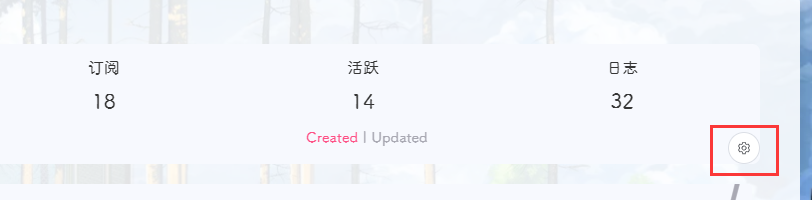

# 前端部署

## 方案：yyyz

推荐使用朋友圈5.x版本最新前端，基于林木木的方案进行优化，同时添加管理面板，方便进行配置管理。

部署方法：

新建一个页面，比如hexo在博客根目录使用命令

```bash
hexo new page fcircle
```

可以看到`source/fcircle/index.md` 文件，打开该文件，粘贴以下内容（注意修改api地址）：

```markdown
---
title: 朋友圈
date: 2022-10-09 00:38:16
---

<div id="app"></div>
<script>
    let UserConfig = {
        // 填写你的api地址
        private_api_url: 'http://192.168.142.88:8000/',
        // 点击加载更多时，一次最多加载几篇文章，默认10
        page_turning_number: 10,
        // 头像加载失败时，默认头像地址
        error_img: 'https://sdn.geekzu.org/avatar/57d8260dfb55501c37dde588e7c3852c',
        // 进入页面时第一次的排序规则
        sort_rule: 'created'
    }
</script>
<script type="text/javascript" src="https://npm.elemecdn.com/imgscdn@1.1.42/fcircle/app.min.js"></script>
<script type="text/javascript" src="https://npm.elemecdn.com/imgscdn@1.1.42/fcircle/bundle.js"></script>
```

访问域名下的`/fcircle`即可看到效果。

如果觉得该cdn比较慢，可以手动将这两个js文件放到你认为更快的cdn上。

新版前端在顶部右下角卡片新增管理面板：



点击即可进入。第一次部署成功后，**输入第一个密码的同时设置密码。请设置一个安全可靠的密码，并防止泄露**。

当保存设置时，由于网络原因，可能需要一段时间响应，尽量避免连续保存。

除了在管理面板配置之外，朋友圈同样支持修改配置文件进行配置，详见[配置项说明](settings.md)。

## 方案：林木木

[@林木木](https://immmmm.com/)的方案，已经完成与主仓库4.x版本api的适配。

简单介绍部署方法，更多细节请[查看原文](https://immmmm.com/hi-friends-circle/)。

新建一个页面，比如hexo在博客根目录使用命令

```bash
hexo new page fcircle
```

可以看到`source/fcircle/index.md` 文件，打开该文件，粘贴以下内容（注意修改api地址）：

```markdown
---
title: 朋友圈
date: 2022-01-29 15:23:17
---

<!-- 挂载友链朋友圈的容器 -->
<div class="post-content">
<div id="cf-container">与主机通讯中……</div>
</div>
<!-- 加样式和功能代码 -->
<!-- 将apiurl改成你后端生成的api地址 -->
<script type="text/javascript">
  var fdataUser = {
    apiurl: 'https://hexo-circle-of-friends-circle.vercel.app/'
  }
</script>
<link rel="stylesheet" href="https://cdn.jsdelivr.net/gh/lmm214/immmmm/themes/hello-friend/static/fcircle-beta.css">
<script type="text/javascript" src="https://cdn.jsdelivr.net/gh/lmm214/immmmm/themes/hello-friend/static/fcircle-beta.js"></script>
```

访问域名下的`/fcircle`即可看到效果。

如果觉得jsdelivr比较慢，可以手动将js、css文件放到你认为更快的cdn上。

## 方案：Akilar-SAO

店长[@Akilar](https://akilar.top/posts/62f13a97/)的方案，旧版3.x方案，暂未适配新api。

参考：https://akilar.top/posts/62f13a97/

## 方案：Heo

由于洪哥咕咕，此部分由[@安知鱼提供的部署方案](https://anzhiy.cn/posts/3753.html)代替。
