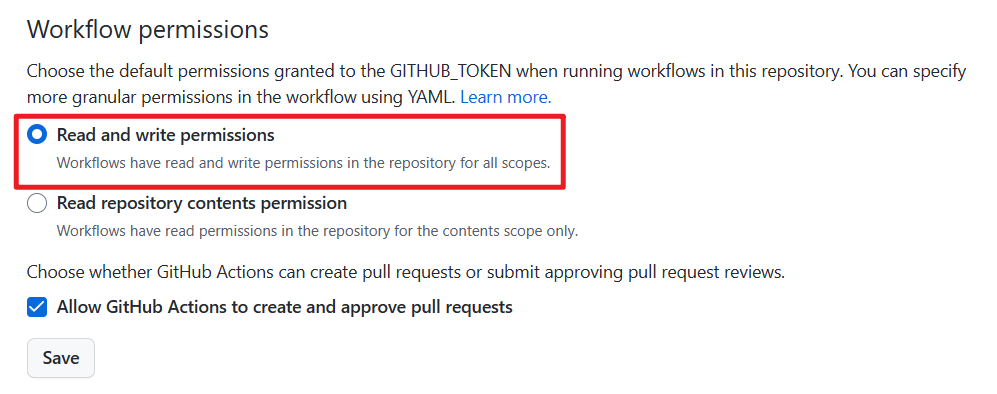
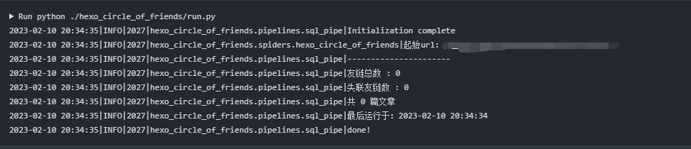

# 常见问题

## github部署的相关问题

### 如何创建leancloud数据库？

前往[leancloud国际版官网](https://leancloud.app/)注册账号并登录。

前往[控制台](https://console.leancloud.app/apps)新建应用，应用名称无限制


### 如何获取`APPID`和`APPKEY`？

进入leancloud应用中，点击`设置-->应用凭证`，获取`AppID`和`AppKey`，


### sqlite或者data.json无法上传至仓库的问题

见[issues/87](https://github.com/Rock-Candy-Tea/hexo-circle-of-friends/issues/87)，github仓库更新了默认的权限，fork后的仓库似乎只保留`read`权限，导致仓库无法上传文件。

可尝试以下方案：

点击仓库的`setting-->Actions-->General-->勾选Read and write permissions-->Save`



## server部署的相关问题

### 如何安装python环境？

安装依赖：

```bash
yum -y install zlib-devel bzip2-devel openssl-devel ncurses-devel sqlite-devel readline-devel tk-devel gdbm-devel db4-devel libpcap-devel xz-devel libffi-devel yum vim gcc
```

安装python

```bash
wget https://www.python.org/ftp/python/3.8.8/Python-3.8.8.tgz
tar -zxf Python-3.8.8.tgz && cd Python-3.8.8
./configure --prefix=/usr/local/python3
make && make install
```

建立软连接

```bash
ln -s /usr/local/python3/bin/python3.8 /usr/bin/python3
ln -s /usr/local/python3/bin/pip3.8 /usr/bin/pip3
```

验证：

```bash
python3 --version
```

出现版本号即安装成功。

安装yaml：

```bash
pip3 install pyyaml
```

### 如何安装git？

```bash
yum install -y git
```

### 如何取消运行？

如果需要关闭爬虫和api，需要找到其进程号

```bash
ps aux
```


杀掉对应的进程即可

```bash
kill -9 7584
kill -9 7585
```

4.3.1以上的版本增加了一个自动部署脚本，使用`python3 deploy.py`命令可以打开它，里面会有一键取消运行的选项。

### 如何查看运行日志？

日志文件保存在`/tmp/crawler.log`为前缀的文件中，可以通过命令查看：

```bash
cat /tmp/crawler.log
```

另外，在最新的前端管理面板中，可直接下载运行日志。

## docker部署的相关问题

### 如何安装git？

```bash
yum install -y git
```

### 如何安装docker？

安装依赖：

```bash
yum install -y yum-utils device-mapper-persistent-data lvm2
```

配置yum源

```bash
yum-config-manager --add-repo https://download.docker.com/linux/centos/docker-ce.repo
```

安装`docker`

```bash
yum update -y && yum install -y docker-ce
```

开启docker服务

```bash
systemctl start docker
```

查看docker版本

```bash
docker -v
```

设置开机自启动

```bash
systemctl enable docker
```

### 如何查看运行日志？

日志文件保存在`/tmp/crawler.log`为前缀的文件中，可以通过命令查看：

```bash
cat /tmp/crawler.log
```

另外，在最新的前端管理面板中，可直接下载运行日志。

### 如何取消运行？

```bash
docker ps -a # 查看容器
docker stop 容器id && docker rm 容器id  # 删掉对应容器
docker rmi 镜像id  # 删掉镜像
```

4.3.1以上的版本增加了一个自动部署脚本，使用`python3 deploy.py`命令可以打开它，里面会有一键取消运行的选项。

## 其他问题

### mysql数据库字符集报错

见[issues/25](https://github.com/Rock-Candy-Tea/hexo-circle-of-friends/issues/25)，如果所爬取的数据中含有emoji表情，请设置mysql字符集为`utf8mb4`，否则会报`Incorrect string value`错误。

### 5.x前端在volantis主题显示的问题

见[issues/65](https://github.com/Rock-Candy-Tea/hexo-circle-of-friends/issues/65)， 修改朋友圈page页面，增加如下`css`：

```markdown
<style>
article#page {
    transform: none;
    transition: none;
    backdrop-filter: none;
}
</style>
```

### 如何修改前端管理面板密码？

目前并不计划提供管理面板修改密码的功能，如需修改密码，请自行清空数据库`auth`和`secret`表，清除前端缓存重新登录即可设置新密码。

### 获取文章为0、管理面板出现`status code 500`、`start error`错误

检查运行日志，如果获取文章数为`0`，则代表没有爬取到任何文章，数据库没有保存任何文章数据，则自然而然后续的步骤也会报错。



无法抓取到文章解决方案：

1、查看你的起始`LINK`页面主题是否被朋友圈适配；

2、如果不幸你的主题未适配，则建议采用[配置项友链](settings.md?id=项目配置)；

3、主动适配我们提供的通用抓取规则`common1`或`common2`，参考[友链页适配](developmentdoc.md?id=友链页适配)；
