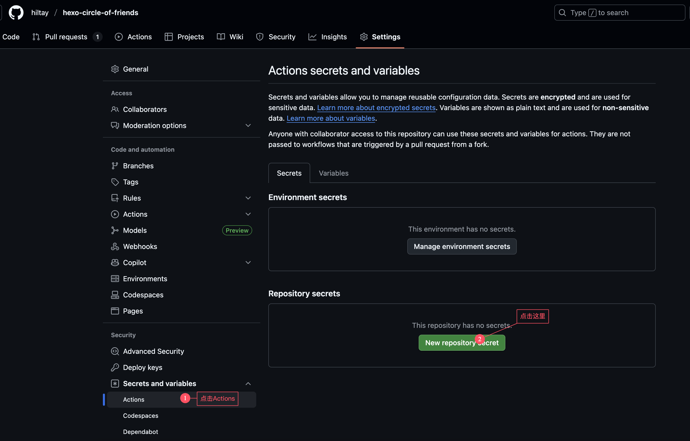

# 常见问题

## github 部署的相关问题

### 如何添加 Secret？

点击仓库的`Settings-->Secrets and variables-->Actions-->New repository secret`



<!-- 添加4个环境变量secret：

- `GH_NAME`：github名称，也就是你的用户名
- `GH_EMAIL`：github邮箱，填写你注册github的邮箱
- `GH_TOKEN`：github访问token，获取方式，请参考[官方文档](https://docs.github.com/cn/authentication/keeping-your-account-and-data-secure/creating-a-personal-access-token)，其中，`Select scopes`选择`repo`和`workflow`。
- `STORAGE_TYPE`：存储方式，填写`sqlite` -->

### sqlite 或者 data.json 无法上传至仓库的问题

见[issues/87](https://github.com/Rock-Candy-Tea/hexo-circle-of-friends/issues/87)，github 仓库更新了默认的权限，fork 后的仓库似乎只保留`read`权限，导致仓库无法上传文件。

可尝试以下方案：

点击仓库的`setting-->Actions-->General-->勾选Read and write permissions-->Save`


## server 部署的相关问题

### 如何安装 git？

```bash
yum install -y git
```

### 如何取消运行？

```bash
chmod +x && ./stop.sh
```

### 如何查看运行日志？

日志文件保存在`./log/`下。

## 其他问题

### mysql 数据库字符集报错

见[issues/25](https://github.com/Rock-Candy-Tea/hexo-circle-of-friends/issues/25)，如果所爬取的数据中含有 emoji 表情，请设置 mysql 字符集为`utf8mb4`，否则会报`Incorrect string value`错误。

### 5.x 前端在 volantis 主题显示的问题

见[issues/65](https://github.com/Rock-Candy-Tea/hexo-circle-of-friends/issues/65)， 修改朋友圈 page 页面，增加如下`css`：

```markdown
<style>
article#page {
    transform: none;
    transition: none;
    backdrop-filter: none;
}
</style>
```
