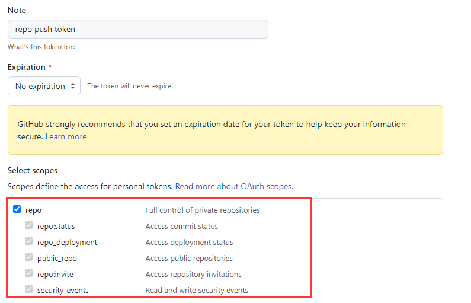

# 配置项说明

主要分为项目配置和环境变量配置。

## 项目配置

项目配置在仓库中的`/hexo_circle_of_friends/setting.py`文件：

请根据文件中的注释，结合本节说明，修改其中的内容。

- **OUTDATE_CLEAN**：默认为60。超过这个值（距今超过60天）的文章，会在数据库中被删除。

- **LINK**：起始的友链页面和爬取策略，支持添加多个，详细见注释说明。

- **SETTINGS_FRIENDS_LINKS**：配置项友链。这是一种通用的方法，如果程序不支持爬取你的友链页，请打开此项。

  - 关于**json_api**选项，4.3.0以后支持通过提供api对友链进行配置，返回格式必须为json，格式如下：

    ```json
    {"friends":[[友链1],[友链2],[友链3],[友链4]....]}
    ```

    友链内容同list字段格式。

- **GITEE_FRIENDS_LINKS**：从gitee issues中获取友链信息。

- **GITHUB_FRIENDS_LINKS**：从github issues中获取友链信息。

- **BLOCK_SITE**：屏蔽站点，配置在这里的网址不会被爬取。比如，你的友链页添加了自己，并且不想被爬虫获取，就可以把自己的主页地址屏蔽掉。

- **HTTP_PROXY**：如果想为爬虫设置HTTP代理，将此项设为True，然后根据你选择的数据库不同，添加环境变量。名称为`PROXY`，值为`[IP]:[端口]`，比如：192.168.1.106:8080。**注意，目前只支持添加一个HTTP代理。**

- **DATABASE**：数据的存储方式，目前支持将数据保存在`leancloud`、`mysql`、`sqlite`，默认为`leancloud`。

- **DEPLOY_TYPE**：整个项目的部署方式，目前支持将项目部署在`github`、`server`、`docker`，默认为`github`。

## 环境变量配置

### github部署

如果采用github部署方式，环境变量需要在你fork的仓库下创建`secert`，根据存储方式的不同，需要配置的环境变量也不同。

可以在`/.github/workflows/main.yml`文件中查看。

```yaml
env:
  # 在这里查看需要添加的secert
  # 通用配置
  STORAGE_TYPE: leancloud # 请修改为你的存储方式，默认为leancloud
  PROXY: ${{ secrets.PROXY }} # 可选，http代理
  # leancloud、mysql、sqlite配置三选一即可
  # leancloud配置
  APPID: ${{ secrets.APPID }}
  APPKEY: ${{ secrets.APPKEY }}
  # mysql配置
  MYSQL_USERNAME: ${{ secrets.MYSQL_USERNAME }} # 登录用户名
  MYSQL_PASSWORD: ${{ secrets.MYSQL_PASSWORD }} # 登录密码
  MYSQL_IP: ${{ secrets.MYSQL_IP }} # 数据库IP地址
  MYSQL_DB: ${{ secrets.MYSQL_DB }} # 要连接到的库的名称
  # sqlite配置，用于将db文件上传到github仓库
  GITHUB_NAME: ${{ secrets.GH_NAME }} # 你的github昵称
  GITHUB_EMAIL: ${{ secrets.GH_EMAIL }} # 你的github邮箱
  GITHUB_TOKEN: ${{ secrets.GH_TOKEN }} # github token
  # mongodb配置
  MONGODB_URI: ${{ secrets.MONGODB_URI }}  # mongodb URI 支持'mongodb://'和'mongodb+srv://'
```

比如，如果使用sqlite，仓库需要添加的secert为：`GITHUB_NAME`，`GITHUB_EMAIL`，`GITHUB_TOKEN`。

### server部署

如果采用server部署方式，环境变量配置需要修改`server.sh`文件。

修改时注意，`#`为注释，需要启用的环境变量请把`#`去掉。

```shell
#!/bin/bash
pip3 install -r ./hexo_circle_of_friends/requirements.txt -i https://pypi.douban.com/simple/

### 通用配置
export EXPOSE_PORT=8000
export RUN_PER_HOURS=6
#export PROXY=""
### leancloud配置
export APPID=""
export APPKEY=""
### mysql配置
#export MYSQL_USERNAME=""
#export MYSQL_PASSWORD=""
#export MYSQL_IP=""
#export MYSQL_DB=""
### mongodb配置
#export MONGODB_URI=""
nohup python3 -u ./hexo_circle_of_friends/run.py > /tmp/crawler.log 2>&1 &
nohup python3 -u ./api/main.py > /tmp/api.log 2>&1 &
```

请根据文件中的注释，结合本节说明，修改其中的内容。

- **EXPOSE_PORT**：指定api的暴露端口，默认为8000。
- **RUN_PER_HOURS**：爬虫每隔几小时运行一次，默认为6。此项必须是一个正整数。
- **PROXY**：HTTP代理，目前只支持添加一个，示例：`192.168.1.106:8080`
- **APPID**：leancloud的APPID
- **APPKEY**：leancloud的APPKEY
- **MYSQL_USERNAME**：mysql登录用户名
- **MYSQL_PASSWORD**：mysql登录密码
- **MYSQL_IP**：数据库IP地址
- **MYSQL_DB**：要连接到的库的名称
- **MONGODB_URI**：连接mongodb的连接字符串URI，支持`mongodb://`和`mongodb+srv://`

### docker部署

如果采用server部署方式，环境变量配置需要修改`Dockerfile`文件。

修改时注意，`#`为注释，需要启用的环境变量请把`#`去掉。

```dockerfile
FROM python:3.8
MAINTAINER yyyz
COPY . /
### 在这里配置环境变量
### 通用配置
ENV RUN_PER_HOURS=6
#ENV PROXY=""
### leancloud配置
ENV APPID=""
ENV APPKEY=""
### mysql配置
#ENV MYSQL_USERNAME=""
#ENV MYSQL_PASSWORD=""
#ENV MYSQL_IP=""
#ENV MYSQL_DB=""
### mongodb配置
#ENV MONGODB_URI=""
EXPOSE 8000
WORKDIR /
RUN cd ./hexo_circle_of_friends && pip3 install -r requirements.txt -i https://pypi.douban.com/simple/
CMD bash ./docker.sh
```

请根据文件中的注释，结合本节说明，修改其中的内容。

- **RUN_PER_HOURS**：爬虫每隔几小时运行一次，默认为6。此项必须是一个正整数。
- **PROXY**：HTTP代理，目前只支持添加一个，示例：`192.168.1.106:8080`
- **APPID**：leancloud的APPID
- **APPKEY**：leancloud的APPKEY
- **MYSQL_USERNAME**：mysql登录用户名
- **MYSQL_PASSWORD**：mysql登录密码
- **MYSQL_IP**：数据库IP地址
- **MYSQL_DB**：要连接到的库的名称
- **MONGODB_URI**：连接mongodb的连接字符串URI，支持`mongodb://`和`mongodb+srv://`

## 配置示例

给出两个示例，其它的配置组合大同小异，请自行尝试。

### github+sqlite

如果想使用github+sqlite，修改`settings.py`文件：

```python
# 存储方式，可选项：leancloud，mysql, sqlite；默认为leancloud
DATABASE = "sqlite"

# 部署方式，可选项：github，server，docker；默认为github
DEPLOY_TYPE = "github"
```

修改`main.yml`文件：

```yaml
env:
  # 通用配置
  STORAGE_TYPE: sqlite # 如果不配置，默认为leancloud
```

添加secert：`GH_NAME`，`GH_EMAIL`，`GH_TOKEN`

`GH_TOKEN`获取方式，请参考[官方文档](https://docs.github.com/cn/authentication/keeping-your-account-and-data-secure/creating-a-personal-access-token)，其中，`Select scopes`选择`repo`。



### docker+mysql

如果想使用docker+mysql，修改`settings.py`文件：

```python
# 存储方式，可选项：leancloud，mysql, sqlite；默认为leancloud
DATABASE = "mysql"

# 部署方式，可选项：github，server，docker；默认为github
DEPLOY_TYPE = "docker"
```

修改`Dockerfile`文件的mysql部分配置：

```dockerfile
### 在这里配置环境变量
### 通用配置
ENV RUN_PER_HOURS=6
#ENV PROXY=""
### leancloud配置
ENV APPID=""
ENV APPKEY=""
### mysql配置
ENV MYSQL_USERNAME="root"
ENV MYSQL_PASSWORD="xxxx"
ENV MYSQL_IP="xx.xx.xx.xx"
ENV MYSQL_DB="test"
### mongodb配置
#ENV MONGODB_URI=""
```

