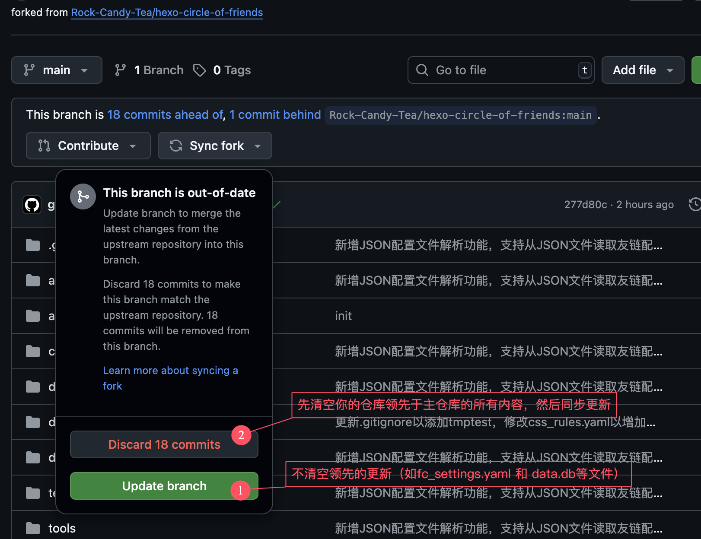

# 版本更新

## github 版本更新：

您只需要在您 fork 的仓库点击 `Sync fork` 即可更新到最新版本。

- `Discard xx commits`：先清空你的仓库领先的提交（如`data.db`，`fc_settings.yaml`等文件），然后同步更新（`Update branch`有冲突时可以选择）
- `Update branch`：不清空领先的提交，直接同步（建议优先尝试）



## server 版本更新

拉取最新代码和文件：

```bash
git pull origin main
```

> [可选项]：如果拉取失败，尝试克隆仓库：
>
> ```bash
> git clone https://github.com/Rock-Candy-Tea/hexo-circle-of-friends
> ```

重新获取二进制文件，放到对应的目录替换即可。

如果更新遇到问题，请[及时反馈](contactus)。

## 前端更新

前往[前端部署](frontenddeploy)获取最新 cdn。

## 导出配置文件和数据

更新版本时，为了保留配置，可以手动将配置导出，（使用 sqlite 的，还需要将数据库文件导出）。

server 部署：

直接保存项目目录下的

- `data.db`：sqlite 数据库
- `fc_settings.yaml`：配置文件

## 注意事项

如果觉得本项目不错，欢迎为我们点个 ⭐Star
